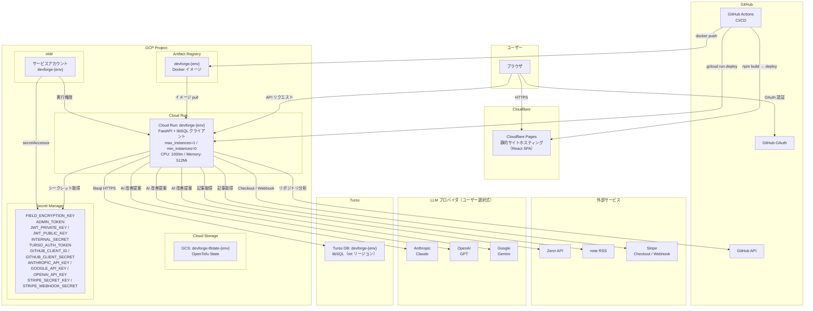

# DevForge

キャリア関連ドキュメント（職務経歴書）の作成・管理。
GitHub活動分析、ブログ連携による発信力を集計
キャリアインテリジェンスを提供するWebアプリケーションです。

## ドキュメント

| ドキュメント | 内容 |
|---|---|
| [docs/development.md](./docs/development.md) | Nix devshell・初回セットアップ・ローカル開発・テスト/リント |
| [docs/deployment.md](./docs/deployment.md) | 本番デプロイ（GCP）・OpenTofu インフラ構成・CI/CD・ブランチ保護 |
| [docs/api.md](./docs/api.md) | REST API 一覧・環境変数リファレンス |
| [docs/data-model.md](./docs/data-model.md) | Turso (libSQL) 運用・Alembic マイグレーション・データ設計 |
| [docs/adr/](./docs/adr/) | アーキテクチャ判断記録（ADR） |
| [docs/runbooks/](./docs/runbooks/) | 運用 Runbook |

## 主な機能

### ドキュメント管理
- **基本情報**: 氏名・記載日・資格の管理
- **職務経歴書**: 職務要約、自己PR、職務経歴、技術スタックの入力とPDF/Markdown出力
- フォーム入力状態を Redux でページ遷移間に保持（入力途中で別ページに移動しても失われない）

### AIアシスタント（職務経歴書の改善提案）
- 職務要約・自己PR・職務経歴・プロジェクトのスコープを選び、AIに文章改善を依頼（DevForge Agent / ADR-0010）
- **マルチプロバイダ対応**: Claude（Anthropic）/ GPT（OpenAI）/ Gemini（Google）からモデルを選択（ADR-0013）。プロバイダはモデル選択に紐づいて切り替わる
- 提案はフォームの入力状態にのみ反映し、保存はユーザーが明示的に実行（Agent 自体は DB を更新しない）
- 有料モデルはプリペイド式クレジットで従量課金（Stripe Checkout / ADR-0012）。無料モデルも提供
- ローカル開発では Ollama でオフライン実行可能（`LLM_LOCAL_OLLAMA`）

### GitHub連携
- GitHub OAuthログインしたユーザーのリポジトリを取得し、使用技術を可視化
- 言語構成・フレームワーク・DevTools・インフラツールを依存関係から検出
- バックグラウンド非同期処理（202 Accepted → ステータスポーリング方式）

### ブログ連携
- **Zenn** / **note** のアカウント連携・記事同期
- 記事メトリクス（タイトル、URL、公開日、いいね数、タグ）の一覧管理
- **ブログスコアリング**: 投稿頻度・反応数・技術記事比率等をもとにスコアを算出

### 通知
- GitHub連携などのバックグラウンドタスクの成功/失敗をサイドバーの通知ベルで通知
- 未読バッジ表示（30秒ポーリング）・ドロップダウンパネルで一覧表示
- 「全て既読」ボタン・パネル外クリックで閉じる

## 技術スタック

| レイヤー | 技術 |
|---|---|
| フロントエンド | React 18, TypeScript, Vite, Redux Toolkit, Recharts, marked |
| バックエンドAPI | Python 3.13, FastAPI, SQLAlchemy, Pydantic |
| AI / LLM | Anthropic Claude / OpenAI GPT / Google Gemini（ユーザー選択式・ADR-0013）、ローカルは Ollama |
| 決済 | Stripe Checkout（クレジット購入・従量課金 / ADR-0012） |
| データベース | Turso (libSQL / SQLite 互換、`sqlalchemy-libsql`) |
| 認証 | JWT Cookie (python-jose), bcrypt, GitHub OAuth |
| 暗号化 | Fernet（フィールド暗号化） |
| PDF出力 | WeasyPrint（職務経歴書）, ReportLab（分析レポート補助） |
| インフラ | GCP (Cloud Run, Artifact Registry, Secret Manager), Turso, Cloudflare Pages |
| IaC | OpenTofu（モジュール構成、マルチ環境） |
| CI/CD | GitHub Actions |

## クイックスタート

初回セットアップ（`nix develop` / `make setup` / `make generate-keys` / `make dev`）と
CI 相当の一括実行（`make ci`）の手順は [docs/development.md](./docs/development.md) を正本として参照してください。
README にコマンドを再掲すると docs と二重管理になり同期漏れの原因になるため、リンクのみとしています。

## システム構成図

## 使用 OSS / ライセンス表記

DevForge は多くのオープンソースソフトウェアに支えられています。直接依存している OSS の一覧と各ライセンス・配布元へのリンクは [THIRD_PARTY_LICENSES.md](./THIRD_PARTY_LICENSES.md) にまとめています（各 OSS の権利はそれぞれの著作権者に帰属します）。

依存を追加・更新した際は `make licenses` で再生成してください。
