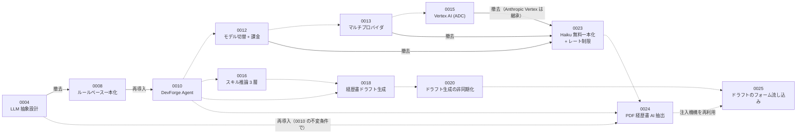
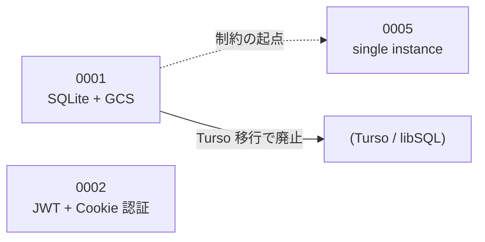
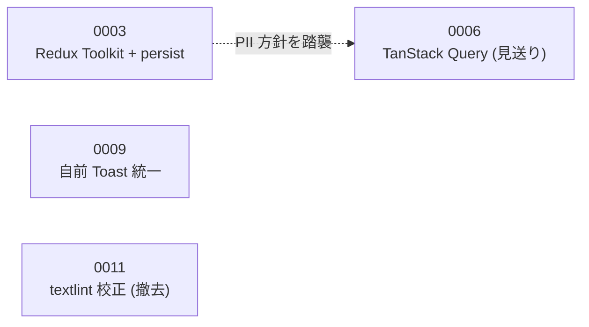
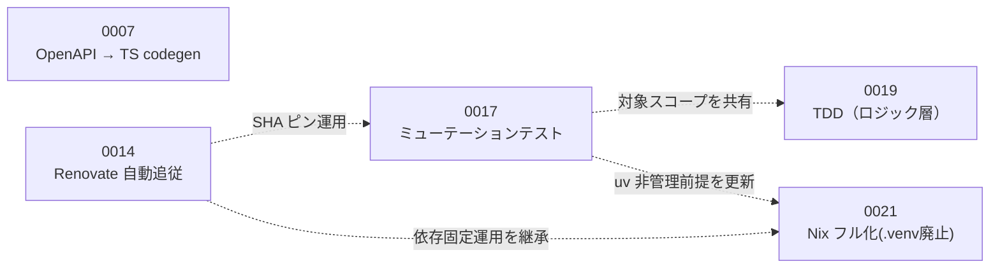

# ADR 索引

- **本ファイルが ADR の一覧・関係（テーマ・置き換え・関連）の正本**。CONTRIBUTING.md 等に一覧を複製しない。
- ADR を新規作成・ステータス変更したら、同じ PR で本索引を更新する（手順: [CONTRIBUTING.md](../../CONTRIBUTING.md) の「ADR」節）。
- 「全 ADR 一覧」表の **ファイル存在・ステータス・見出し番号は CI で機械検証される**（`scripts/lint-adr-index.sh` / `make lint-adr-index`）。テーマ・関連・決定系統図は人間が編集する（機械検証外）。

## 現在有効な決定（Accepted）

いま生きている判断の早見表。詳細・経緯は各 ADR と「テーマ別の決定系統」を参照。

| No. | タイトル | テーマ | 一言サマリ |
|---|---|---|---|
| [ADR-0002](./0002-jwt-cookie-auth.md) | JWT + Cookie 認証方式の採用 | 基盤 | GitHub OAuth only + JWT（RS256）を HttpOnly Cookie で扱い、PII をブラウザストレージに置かない |
| [ADR-0003](./0003-redux-toolkit-persist.md) | Redux Toolkit + redux-persist の採用 | フロントエンド | フォーム一時キャッシュをページ遷移をまたいで保持（PII は localStorage 非保存） |
| [ADR-0005](./0005-cloudrun-single-instance.md) | Cloud Run single instance 構成の採用 | 基盤 | コスト最優先で max-instances=1 / min-instances=0。個人開発規模を明示的な設計入力にする |
| [ADR-0007](./0007-openapi-typescript-codegen.md) | OpenAPI → TypeScript 型コード生成の導入（完全移行） | 開発プロセス / 品質 | Pydantic スキーマを正本に TS 型を自動生成し、drift を CI（codegen-drift）で機械検知 |
| [ADR-0009](./0009-frontend-toast-notification.md) | フロントエンドの一時通知をトースト方式に統一する | フロントエンド | 外部ライブラリを足さず自前 Toast 基盤（Context + Portal）に一時通知を統一 |
| [ADR-0010](./0010-devforge-agent.md) | DevForge Agent 機能の導入 | LLM / Agent | 対話型 LLM を再導入。DB 非更新原則・スキーマ/プロンプトの責務分離・失敗の明示的エラー化 |
| [ADR-0014](./0014-renovate-dependency-automation.md) | Renovate による依存更新の自動化 | 開発プロセス / 品質 | 依存の完全固定（SHA / `==` ピン）を維持したまま、追従だけを Renovate で自動化 |
| [ADR-0016](./0016-github-skill-inference.md) | GitHub 連携によるスキル推論基盤 | LLM / Agent | スキルを 3 層に分離（機械=幅 / 人間=深さ）。推論パイプラインは決定論を維持 |
| [ADR-0017](./0017-mutation-testing-and-slack-notifications.md) | ミューテーションテスト週次実行と Slack 通知チャンネル分割 | 開発プロセス / 品質 | テストの検出力を週次ミューテーションで可視化（warn-only）、CI 通知を用途別 Slack へ分割 |
| [ADR-0018](./0018-github-resume-draft-generation.md) | GitHub 連携データからの経歴書ドラフト生成 | LLM / Agent | 構造はルールベース・自然文だけ LLM のハイブリッド。何も永続化せず PDF プレビューのみ返す |
| [ADR-0019](./0019-tdd-for-logic-layer.md) | 決定論的ロジック層への TDD（テスト駆動開発）導入 | 開発プロセス / 品質 | mutation 対象と同一スコープに red→green→refactor を必須化。テスト随伴を lint-tdd で機械検証 |
| [ADR-0020](./0020-async-resume-draft-generation.md) | 経歴書ドラフト生成の非同期化と最小永続化 | LLM / Agent | ドラフト生成を独立の非同期タスク化。payload だけを連携ドメインに最小永続化し DL 時に再レンダリング |
| [ADR-0021](./0021-nix-managed-python-env.md) | backend Python 環境の Nix フルマネージド化（.venv 廃止） | 開発プロセス / 品質 | 依存 SSoT を pyproject + uv.lock に一本化し、devshell / CI / 本番イメージの 3 経路を uv2nix（flake）で統一 |
| [ADR-0022](./0022-remove-blog-integration.md) | ブログ連携機能の撤去 | プロダクト / 機能整理 | 経歴書へ還流せずスコアが逆効果になり得るブログ連携（テーブル 3 つ・router / service / web 一式）を全量撤去 |
| [ADR-0023](./0023-remove-billing-multiprovider.md) | プリペイド課金・マルチプロバイダの撤去と Haiku 無料一本化 | LLM / Agent | 課金の壁を撤去し Haiku 無料一本化 + ユーザ単位レート制限へ縮退。Anthropic は Vertex(ADC) 維持、Gemini/OpenAI/Stripe を撤去 |
| [ADR-0024](./0024-pdf-resume-import.md) | 手持ち PDF 経歴書のフォーム流し込み（AI 抽出の再導入） | LLM / Agent | 空フォーム離脱の解消。テキスト埋め込み PDF を pypdf 抽出 + Haiku 構造化で Resume 互換 payload に。同期・DB 非更新でフォーム注入（#524）へ渡す。ADR-0004→0008 で撤去した AI 抽出を ADR-0010 の不変条件で再導入 |
| [ADR-0025](./0025-resume-draft-form-injection.md) | 経歴書ドラフトのフォーム流し込み（payload の JSON 公開） | LLM / Agent | ドラフトの「手で転記」を解消。生成 payload を `GET /api/agent/resume-draft/result` で JSON 公開し、#524 の注入機構でフォームへ流し込む。生成設計（0018/0020）は変えず出力の返し方だけ拡張・DB 非更新 |

## 全 ADR 一覧

ステータスの定義と変更手順は [CONTRIBUTING.md](../../CONTRIBUTING.md) を参照。
「原則」列（P1〜P7）はその ADR の中心的な判断軸で、定義と対応マトリクスは [docs/design-principles.md](../design-principles.md) を参照。

| No. | タイトル | ステータス | テーマ | 置き換え・関連 | 原則 |
|---|---|---|---|---|---|
| [ADR-0001](./0001-sqlite-gcs-backup.md) | SQLite + GCS バックアップ方式の採用 | Deprecated | 基盤 | Turso (libSQL) 移行で廃止。関連: 0005（同時移行前提の強結合） | P1 |
| [ADR-0002](./0002-jwt-cookie-auth.md) | JWT + Cookie 認証方式の採用 | Accepted | 基盤 | — | P2 |
| [ADR-0003](./0003-redux-toolkit-persist.md) | Redux Toolkit + redux-persist の採用 | Accepted | フロントエンド | 関連: 0006（責務境界・PII 方針を踏襲） | P2 |
| [ADR-0004](./0004-llm-provider-abstraction.md) | LLM プロバイダ抽象化（Ollama/Vertex AI）の設計判断 | Superseded by ADR-0008 | LLM / Agent | 0008 が撤去。dev/prod 分離思想は 0010 が再利用 | P6 |
| [ADR-0005](./0005-cloudrun-single-instance.md) | Cloud Run single instance 構成の採用 | Accepted | 基盤 | 関連: 0001（制約の起点）、0012（単一インスタンス前提の原子的 UPDATE） | P1 |
| [ADR-0006](./0006-tanstack-query.md) | TanStack Query 導入検討 | Deprecated | フロントエンド | パイロット未実施で見送り。関連: 0003 | P6 |
| [ADR-0007](./0007-openapi-typescript-codegen.md) | OpenAPI → TypeScript 型コード生成の導入（完全移行） | Accepted | 開発プロセス / 品質 | 関連: 0010（Agent の型契約も codegen 経由） | P3 |
| [ADR-0008](./0008-remove-llm-to-rule-based-design.md) | LLM プロバイダ抽象化の撤去とルールベース設計への統一 | Superseded by ADR-0010 | LLM / Agent | Supersedes: 0004。0010 が「将来の移行条件」の手続きに従い再導入 | P5・P6 |
| [ADR-0009](./0009-frontend-toast-notification.md) | フロントエンドの一時通知をトースト方式に統一する | Accepted | フロントエンド | — | P6 |
| [ADR-0010](./0010-devforge-agent.md) | DevForge Agent 機能の導入 | Accepted | LLM / Agent | Supersedes: 0008。関連: 0004（積み残しリスクを設計段階で解消）、0007 | P4・P5 |
| [ADR-0011](./0011-frontend-textlint-proofread.md) | 職務経歴書のフロントエンド完結型 文章校正（textlint + kuromoji） | Deprecated | フロントエンド | 実装後に運用不要と判断し撤去。関連: 0008（PII 非送信・ルールベース志向） | P2 |
| [ADR-0012](./0012-agent-model-switching-and-prepaid-billing.md) | Agent モデル切り替えとプリペイドクレジット課金 | Superseded by ADR-0023 | LLM / Agent | 0023 が課金を撤去。関連: 0010（チャット契約）、0005（原子的 UPDATE の前提） | P1 |
| [ADR-0013](./0013-multi-provider-llm-selection.md) | マルチプロバイダ LLM（ユーザー選択式） | Superseded by ADR-0023 | LLM / Agent | 0023 がマルチプロバイダを撤去。関連: 0010、0012 | P3 |
| [ADR-0014](./0014-renovate-dependency-automation.md) | Renovate による依存更新の自動化 | Accepted | 開発プロセス / 品質 | 関連: 0017（Actions の SHA ピン運用） | P7 |
| [ADR-0015](./0015-vertex-ai-for-gemini-anthropic.md) | Gemini / Anthropic を Vertex AI（SA→ADC）経由にする | Superseded by ADR-0023 | LLM / Agent | 0023 が Gemini/OpenAI マルチプロバイダを撤去。Anthropic の Vertex(ADC) 認証は 0023 が継承 | P2 |
| [ADR-0016](./0016-github-skill-inference.md) | GitHub 連携によるスキル推論基盤 | Accepted | LLM / Agent | 関連: 0010（責務分離の元思想）、0013、0015 | P4 |
| [ADR-0017](./0017-mutation-testing-and-slack-notifications.md) | ミューテーションテスト週次実行と Slack 通知チャンネル分割 | Accepted | 開発プロセス / 品質 | 関連: 0014 | P3 |
| [ADR-0018](./0018-github-resume-draft-generation.md) | GitHub 連携データからの経歴書ドラフト生成 | Accepted | LLM / Agent | 関連: 0010（不変条件を継承し適用範囲を拡張）、0012（課金配線）、0013・0015（プロバイダ）、0016（データ供給源）、0020（非同期化・最小永続化で更新） | P4・P5 |
| [ADR-0019](./0019-tdd-for-logic-layer.md) | 決定論的ロジック層への TDD（テスト駆動開発）導入 | Accepted | 開発プロセス / 品質 | 関連: 0017（対象スコープの正本を共有）、0007（drift の機械検知パターン） | P3・P5 |
| [ADR-0020](./0020-async-resume-draft-generation.md) | 経歴書ドラフト生成の非同期化と最小永続化 | Accepted | LLM / Agent | 関連: 0018（同期実装を更新）、0010（不変条件を継承）、0012（課金をタスク側へ移設）、0016（データ供給源） | P1・P4・P5 |
| [ADR-0021](./0021-nix-managed-python-env.md) | backend Python 環境の Nix フルマネージド化（.venv 廃止） | Accepted | 開発プロセス / 品質 | 関連: 0017（uv 非管理前提を更新）、0014（依存固定・Renovate manager）、0007（Nix devshell 規約） | P7・P3・P6 |
| [ADR-0022](./0022-remove-blog-integration.md) | ブログ連携機能の撤去 | Accepted | プロダクト / 機能整理 | 手本: 0008（撤去の流儀）。関連: 0010（Agent コンテキストの入力縮小）、0016 | P6・P1 |
| [ADR-0023](./0023-remove-billing-multiprovider.md) | プリペイド課金・マルチプロバイダの撤去と Haiku 無料一本化 | Accepted | LLM / Agent | Supersedes: 0012・0013・0015。関連: 0010（Agent 不変条件を継承）、0018・0020（課金配線を剥がす）、0005 | P1・P6・P2 |
| [ADR-0024](./0024-pdf-resume-import.md) | 手持ち PDF 経歴書のフォーム流し込み（AI 抽出の再導入） | Accepted | LLM / Agent | 継承: 0010（不変条件）、0023（Haiku 固定）。手本: 0018。歴史: 0004→0008（AI 抽出の導入と撤去）。前提: #524 | P1・P2・P5・P6 |
| [ADR-0025](./0025-resume-draft-form-injection.md) | 経歴書ドラフトのフォーム流し込み（payload の JSON 公開） | Accepted | LLM / Agent | 継承: 0010（DB 非更新）、0018・0020（生成設計は不変）。手本: 0024（注入機構 #524）。実装: #525 | P4・P5・P6 |

## テーマ別の決定系統

各テーマの判断がどう連なり・覆されてきたかの系統図。実線 = 置き換え（supersede）、点線 = 参照・前提。

### LLM / Agent

このプロダクトで最も判断の往復が大きい系統。「LLM 抽象の先行実装（0004）→ 利用見込み薄と判断して全撤去（0008）→ 対話型として価値が明確になった時点で、0008 自身が規定した手続きに従い再導入（0010）→ 課金・マルチプロバイダ・データガバナンスへ段階拡張（0012/0013/0015）」という流れで、**撤退条件を先に書いておく運用が実際に機能した実例**になっている。0016 は 0010 の「機械検証可能な制約はコード、不能な制約はプロンプト」という責務分離を「機械=幅 / 人間=深さ」の 3 層モデルへ一般化した。0018 は 0010 の不変条件と 0016 の決定論データを前提に、経歴書ドラフト生成へ「構造=機械 / 自然文=LLM」の分離を適用した。0024 は 0004 で導入し 0008 で撤去した「PDF 経歴書の AI 抽出」を、0010 の不変条件（DB 非更新・明示的エラー契約）と 0023 の Haiku 固定の上で再導入するもので、**空文字握りつぶしという旧敗因を契約で構造的に塞ぐ**再導入の実例になっている。

### 基盤（データ / インフラ / 認証）

0005 の single instance 制約は当初 0001（SQLite の同時書き込み不可）に起因していた。Turso 移行で 0001 は Deprecated になったが、0005 は「コスト最適化・個人開発規模」という別の根拠で存続している。**同じ決定でも根拠が入れ替わることがある**ため、系統図は「何に依存していた判断か」を追う手がかりになる。0002 は独立した判断だが、「PII をブラウザに置かない」方針の起点として 0003 / 0011 に思想面で連なる。

### フロントエンド

導入したもの（0003 / 0009）より、**見送り・撤去の判断（0006 / 0011）が残っていること**がこの系統の価値。0006 はパイロット未実施のまま導入せず、0011 は実装まで行った上で運用不要と判断して撤去した。外部ライブラリを安易に足さない・使われないものを残さない判断の記録として参照する。型定義の正本は backend にある（0007 の codegen が FE の手書き DTO を置き換えた）。

### 開発プロセス / 品質

「正本を 1 つに定め、複製との乖離は機械で検知する」（0007）、「依存は固定し、追従は自動化する」（0014）、「テストの検出力自体を計測する」（0017）、「テストを先に書くプロセスを機械ゲートで支える」（0019。0017 の事後計測と対になる事前プロセス）という、**プロダクト機能ではなく開発体験そのものへの投資**の系統。`docs/metrics/ai-friendliness.md` はこの系統の効果を月次で観測するダッシュボード。0021 は 0014 の依存固定運用を継承しつつ、backend の Python 環境を Nix でフルマネージド化して `.venv` を廃止した（devshell / CI / 本番 Dockerfile の 3 経路を flake + uv.lock に一元化。0017 の「uv 非管理・requirements.txt が lockfile」前提も更新済み）。

## 運用

- **新規作成**: [`0000-template.md`](./0000-template.md) をコピーし、[CONTRIBUTING.md](../../CONTRIBUTING.md) の命名規則・ステータス運用に従う。作成したら本索引の「全 ADR 一覧」（Accepted なら「現在有効な決定」にも）へ行を追加する
- **ステータス変更（supersede / deprecate）**: CONTRIBUTING.md の手順に従い旧 ADR を更新した後、本索引のステータス列・「置き換え・関連」列・決定系統図を更新する
- **検証**: `make lint-adr-index`（CI でも実行される）が「ADR ファイル ↔ 索引の行」の存在・ステータス・見出し番号の突合を行う
