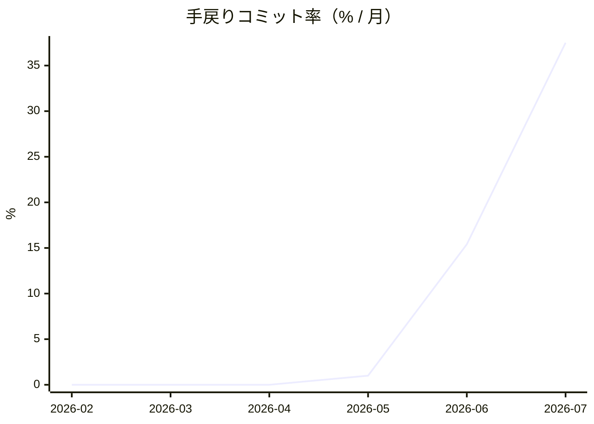
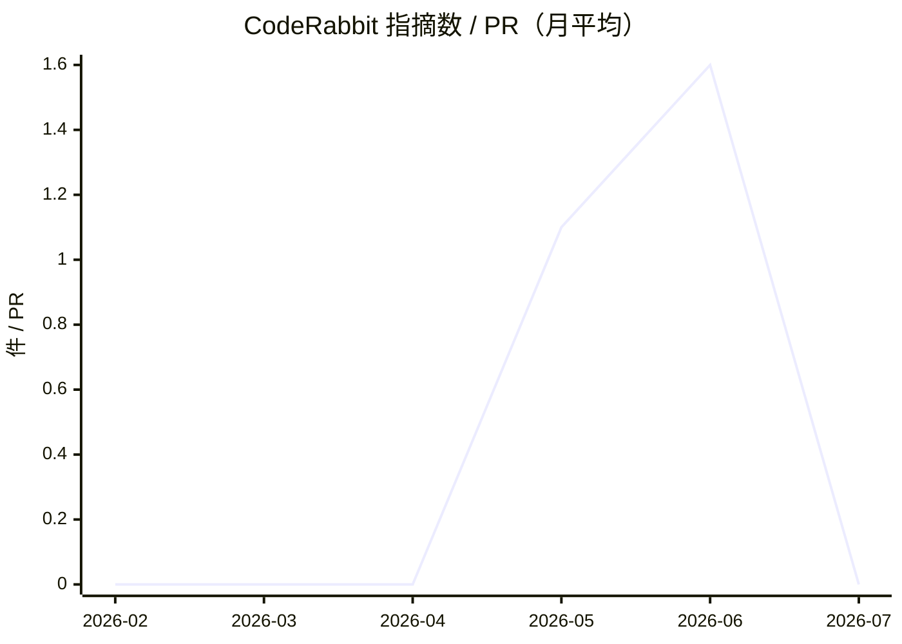
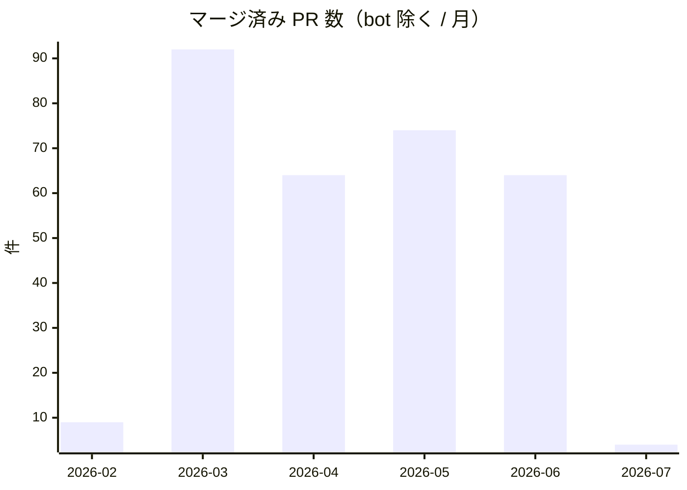
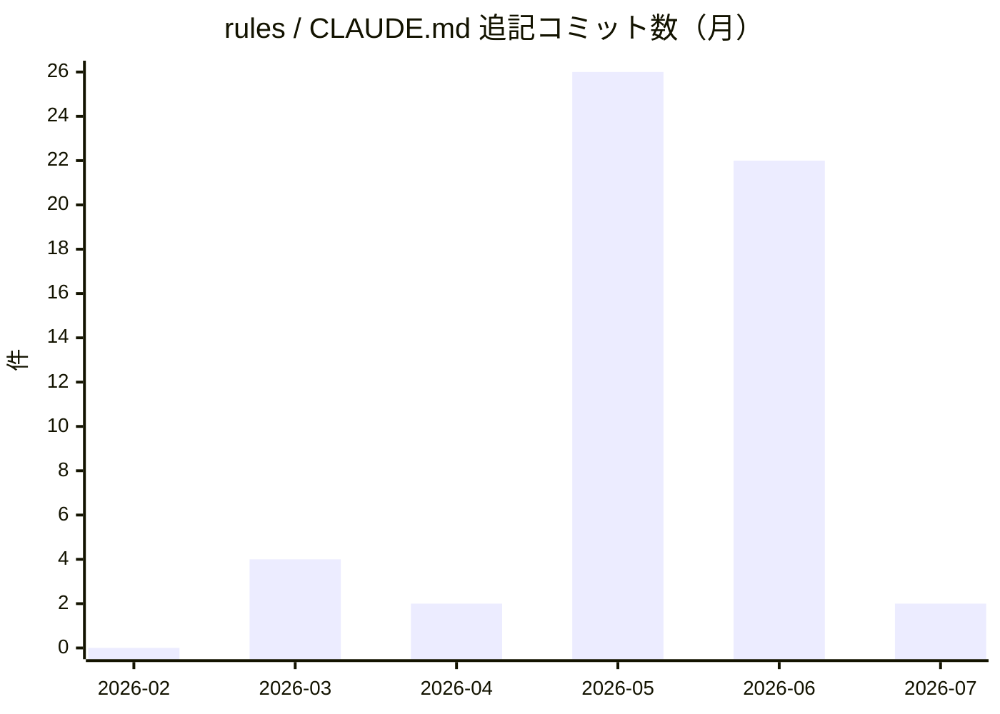

# AI フレンドリーさダッシュボード

<!-- 本ファイルは scripts/metrics-ai-friendliness.sh が全体を再生成する生成物。手で編集しない。 -->

「AI エージェントが不変条件を壊さず開発できるアーキテクチャ」（scoped rules / SSoT lint /
codegen drift 検知）の効果を、GitHub 履歴から取れる代理指標の**月次推移**で観測する。

- 再生成: `make metrics-ai-friendliness`（判定パターン変更後は `--full` で全再取得）
- データ正本: [`ai-friendliness-data.json`](./ai-friendliness-data.json)（PR 単位の計測値。マージ済み PR は不変のため差分のみ取得）
- 最終生成日: 2026-07-02

## 指標の定義

| 指標 | 定義 | 望ましい向き |
|---|---|---|
| 手戻りコミット率 | PR 内コミット（Merge 除く）のうち `review(...)` / `fix(ci)` 等のレビュー・CI 対応コミットの割合 | 低いほど「一発で不変条件を守れている」 |
| CodeRabbit 指摘数 / PR | PR の inline review comments のうち CodeRabbit による件数の PR 平均 | 低いほど機械レビュー前に品質が担保されている |
| ルール追記コミット数 | `.claude/rules` / `CLAUDE.md`（旧 `AGENTS.md`）に触れたコミット数 | 事故由来の追記が減り漸近するのが理想（proxy） |

## 読み方の注意（交絡）

- **比較が有効なのは 2026-05 以降のみ**。レビュー対応コミット規約（`review(...)`）と CodeRabbit の導入以前の月は、手戻り率・指摘数が「ゼロ」に見えるが実際は**観測不能**（規約が無く squash 前の手戻りを識別できない）
- 期間中に **LLM モデル自体が世代交代**しており、改善がアーキテクチャ起因かモデル起因かは分離できない。**因果ではなく記述統計**として読む
- 作者のプロンプト習熟・タスク難度の変動も混ざる
- 直近月は PR 数が少なく率が暴れる（小標本）。月次 PR 数と併せて読む
- ルール追記コミットは構成整理・初期整備も含む proxy であり、すべてが「事故」ではない
- Renovate 等の bot PR は母数から除外している

## 手戻りコミット率（%）

## CodeRabbit 指摘数 / PR

## 月次 PR 数（母数の文脈）

## ルール追記コミット数

## 月次データ

| 月 | PR 数 | コミット | 手戻り | 手戻り率 % | 指摘 | 指摘 / PR | ルール追記 |
|---|---|---|---|---|---|---|---|
| 2026-02 | 9 | 11 | 0 | 0 | 0 | 0 | 0 |
| 2026-03 | 92 | 346 | 0 | 0 | 0 | 0 | 4 |
| 2026-04 | 64 | 622 | 0 | 0 | 0 | 0 | 2 |
| 2026-05 | 74 | 401 | 4 | 1 | 79 | 1.1 | 26 |
| 2026-06 | 64 | 169 | 26 | 15.4 | 101 | 1.6 | 22 |
| 2026-07 | 4 | 8 | 3 | 37.5 | 0 | 0 | 2 |
